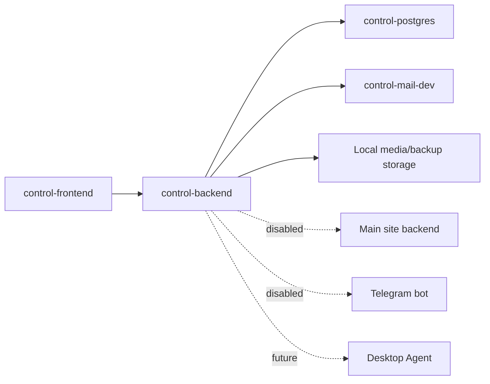

# Architecture

Control Service является отдельным bounded context.

Backend разделён по предметным областям: `auth`, `users`, `roles`, `permissions`, `dashboard`, `games`, `schedule`, `applications`, `services`, `masters`, `players`, `rating`, `gallery`, `stories`, `files`, `projects`, `backups`, `audit`, `notifications`, `settings`, `integration`.

Основные API namespaces:

- `/api/v1/public/**`
- `/api/v1/auth/**`
- `/api/v1/account/**`
- `/api/v1/admin/**`
- `/api/v1/internal/**`

На текущем этапе public endpoints минимальны, internal endpoints подготовлены концептуально, но интеграции выключены.
