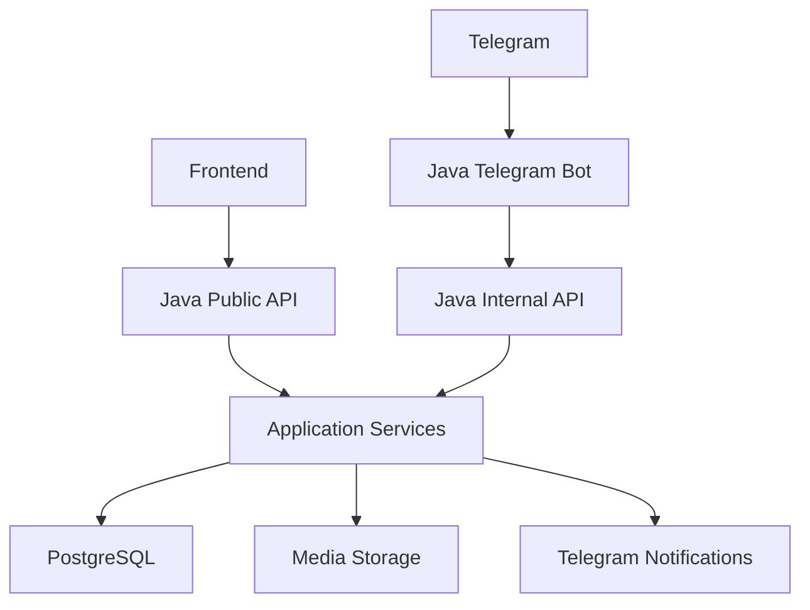

# Java backend architecture

## Цель

Постепенно заменить Node.js/Express backend Java 21 + Spring Boot 3 без изменения пользовательского сайта и без потери данных Railway/PostgreSQL.

## Модули

- `config` — настройки окружения, CORS, datasource, security.
- `security` — защита `/api/internal/**` через `x-internal-token`.
- `notification` — best-effort Telegram-уведомления без логирования секретов.
- `health` — `/health` и `/ready`.
- `schedule` — публичная афиша, запись на игры, архивация прошедших игр.
- `application` — заявки на услуги.
- `gallery` — публичная галерея.
- `rating` — публичный рейтинг через native SQL.
- `audit` — технический журнал действий.
- `consent` — версии согласия и политики.

## Схема сервисов



## Контракты API

Java backend сохраняет старую форму JSON:

- афиша возвращает `{ "games": [...] }`;
- отдельная игра возвращает `{ "game": ... }`;
- галерея возвращает `{ "posts": [...] }` и `{ "post": ... }`;
- заявки возвращают `ok`, сообщение и ID записи.

Это позволяет переключать frontend с Node API на Java API постепенно.

## Данные

JPA entities соответствуют существующим Prisma-таблицам. PostgreSQL enum-колонки остаются enum-колонками, поэтому Java-маппинг использует явные casts через `@ColumnTransformer`.

Деньги и средние значения рейтинга представлены через `BigDecimal`.

## Статусы игр

Активная афиша показывает только:

```text
published
```

Прошедшие игры не удаляются физически. Планировщик помечает их как `completed` после окончания. Если `dateTimeEnd` не задан, используется 6 часов после начала.

## Telegram

На текущем этапе Java backend предоставляет внутренние endpoints для бота, а в `apps/telegram-bot-java` создан первый отдельный Java polling service с health endpoints и базовой командой `/start`.

Полный перенос Telegram-сценариев игр, рейтинга и галереи остаётся отдельным этапом после проверки публичного API и записи заявок.

Планируемая граница:

- Java Telegram-бот не обращается напрямую к базе.
- Все мутации идут через Java application services или защищённый internal API.
- Состояния сценариев хранятся в PostgreSQL `BotSession`, а не в статическом `Map`.
- Один production token не должен одновременно использоваться двумя polling-процессами.

## Media storage

Старый Node backend хранит файлы в `FILE_STORAGE_DIR` и отдаёт ссылки через `PUBLIC_UPLOADS_URL`.

Для Java-этапа нужно ввести интерфейс:

```java
public interface MediaStorage {
    StoredMedia store(MediaUpload upload);
    void delete(String storageKey);
    Resource load(String storageKey);
    boolean exists(String storageKey);
}
```

Минимальный production-вариант на Railway:

- Railway Volume для локального хранения, если сервис один и данные должны переживать redeploy.
- S3-совместимое хранилище как предпочтительный вариант для масштабирования.

Не хранить временные Telegram file URL как постоянные ссылки.

## Idempotency

Для публичных заявок текущая защита:

- уникальность `GameSignup(gameId, contact)`;
- in-memory rate limit для публичных POST.

Для рейтинга и Telegram callback нужно усилить:

- `idempotencyKey` на уровне PostgreSQL;
- `operationId` для batch-операций;
- повторный callback возвращает уже выполненный результат и не меняет статистику второй раз.

## Test architecture

Java-проверка строится вокруг:

- unit tests для парсеров, consent и security filters;
- Spring MVC/security tests для контроллеров;
- Testcontainers PostgreSQL для Flyway и repository/service integration tests;
- mock Telegram HTTP для уведомлений и будущего Java-бота;
- JaCoCo report через `./mvnw verify`.

## Production security

- Секреты не хранятся в коде.
- `/api/internal/**` требует `x-internal-token`.
- CORS задаётся через `CORS_ALLOWED_ORIGINS`.
- Swagger UI отключён по умолчанию.
- `ddl-auto=validate`.
- Request logs содержат `requestId`, method, path, status и duration, но не токены, DATABASE_URL и персональные данные.
